# Generate Brick Breaker

<p align="center">
  <a href="https://brickbreaker-live.netlify.app" target="_blank">
    
  </a>
  <a href="https://github.com/marketplace/actions/generate-brick-breaker">
    
  </a>
  <a href="https://github.com/MakdumIbrohim/generate-brick-breaker/actions">
    
  </a>
  <a href="https://github.com/MakdumIbrohim/generate-brick-breaker/stargazers">
    
  </a>
  <a href="https://github.com/MakdumIbrohim/generate-brick-breaker/blob/main/LICENSE">
    
  </a>
</p>

<p align="center">
  
</p>

Turn your GitHub contribution graph into an automated retro Brick Breaker game animation (SVG or GIF) for your profile README.

---

## Customization Options

#### Ball Skin Options (`ball_skin`)
| Option | Preview |
| :---: | :---: |
| `classic` (default) |  |
| `fire` |  |
| `ice` |  |
| `lightning` |  |
| `poison` |  |

#### Paddle Skin Options (`paddle_skin`)
| Option | Preview |
| :---: | :---: |
| `classic` (default) | Primary theme color |
| `laser` |  |
| `retro` |  |
| `mecha` |  |
| `cyber` |  |

#### Board Theme Options (`theme`)
| Option | Preview |
| :---: | :---: |
| `classic` (default) |  |
| `sky` |  |
| `sky-night` |  |
| `synthwave` |  |
| `matrix` |  |
| `sakura` |  |

#### Custom Brick Color (`brick_color` / `--brick-color` )
*Applies to the `classic` board theme only.*
- **Single HEX (Auto-Gradient)**: Pass 1 HEX color (e.g. `'#00b4d8'`) to automatically generate all 4 brightness levels.
- **Combined Multi-HEX**: Pass 4 comma-separated HEX colors (e.g. `'#FFADAD,#FFD6A5,#FDFFB6,#9BF6FF'`) from lowest to highest level.

#### Ball Speed Options (`ball_speed` / `--speed`)
- **Presets**: `slow` (4.0), `normal` (6.5), `fast` (9.0), `turbo` (12.0).
- **Custom Value**: Any numeric speed from `2.5` to `20.0` (e.g. `6.0`).
- *Default*: `normal` (6.5) — balanced classic arcade speed.

---

### Live Web Studio

Customize skins, test themes, and download your generated game SVG/GIF online without any installation:
#### [https://brickbreaker-live.netlify.app](https://brickbreaker-live.netlify.app)

<video src="https://github.com/user-attachments/assets/9c0854c2-1ca4-4367-9408-904013870ef9" width="50%" autoplay loop muted playsinline></video>

---

### Installation & Usage

#### 1. GitHub Profile Integration (Automated)

1. In your GitHub profile repository (`username/username`), create `.github/workflows/brick-breaker.yml`:

```yaml
name: Generate Brick Breaker

on:
  schedule:
    # Runs automatically every hour to sync new commits
    - cron: "0 * * * *"
  push:
    branches:
      - main
  workflow_dispatch:

jobs:
  build:
    runs-on: ubuntu-latest
    permissions:
      contents: write
    steps:
      - uses: actions/checkout@v4

      - uses: MakdumIbrohim/generate-brick-breaker@main
        with:
          github_token: ${{ secrets.GITHUB_TOKEN }}
          github_user: ${{ github.repository_owner }}

          # Options: game.svg (recommended) or game.gif
          output_path: game.svg

          # Options: classic | fire | ice | lightning | poison
          ball_skin: classic

          # Options: classic | sky | sky-night | synthwave | matrix | sakura
          theme: classic

          # Options: classic | laser | retro | mecha | cyber
          paddle_skin: classic

          # Optional: Custom brick color (applies to classic theme only).
          # - Single HEX (auto-gradient): '#00b4d8'
          # - Combined Multi-HEX (levels 1-4): '#FFADAD,#FFD6A5,#FDFFB6,#9BF6FF'
          # brick_color: '#00b4d8'

          # Optional: Custom ball speed: slow | normal | fast | turbo or number (e.g. '6.5', default: normal).
          # ball_speed: normal

      - name: Commit and Push
        run: |
          git config user.name "github-actions[bot]"
          git config user.email "github-actions[bot]@users.noreply.github.com"
          git add -A
          git diff --staged --quiet || git commit -m "chore: update brick breaker assets"
          git pull --rebase --autostash origin main || true
          git push origin main
```

2. Enable workflow permissions: Repo **Settings** > **Actions** > **General** > **Workflow permissions** > select **Read and write permissions** > **Save**.

3. Add image to your profile `README.md` (use `.svg` or `.gif` matching your `output_path`):
```markdown
<p align="center">
  
</p>
```

> **Note on Image Caching:** GitHub caches profile images through its Camo CDN. If you update settings and the animation does not change immediately, do a hard refresh (`Ctrl + F5` or `Cmd + Shift + R`), open your profile in an Incognito window, or allow 5–15 minutes for the CDN cache to clear.

#### 2. Local Usage

**Using Python:**
```bash
git clone https://github.com/MakdumIbrohim/generate-brick-breaker.git
cd generate-brick-breaker
pip install pillow

# Show help and available options
python generate.py --help
```

Examples:
```bash
# Flexible flag-based syntax (single HEX or 4 combined HEX, fast speed)
python generate.py YourGithubUsername --skin fire --theme classic --paddle mecha --brick-color "#00b4d8" --speed fast
# or with 4 combined HEX colors:
python generate.py YourGithubUsername --skin fire --theme classic --paddle mecha --brick-color "#FFADAD,#FFD6A5,#FDFFB6,#9BF6FF" --speed fast

# Or classic positional syntax
python generate.py YourGithubUsername game.svg fire classic laser "#00b4d8" 14.0
# or with 4 combined HEX colors:
python generate.py YourGithubUsername game.svg fire classic laser "#FFADAD,#FFD6A5,#FDFFB6,#9BF6FF" 14.0
```

**Using Docker (Without installing Python):**
```bash
# Run with Docker Compose (outputs to current folder)
docker compose up

# Build Docker image
docker build -t generate-brick-breaker .

# Run directly with flags (supports all skins, themes, custom colors, and speed)
docker run --rm -v $(pwd):/output generate-brick-breaker YourGithubUsername -o /output/game.svg --skin fire --theme classic --paddle mecha --brick-color "#00b4d8" --speed fast

# Optional: pass GITHUB_TOKEN for real-time GraphQL API
docker run --rm -e GITHUB_TOKEN="ghp_xxx" -v $(pwd):/output generate-brick-breaker YourGithubUsername -o /output/game.svg
```
